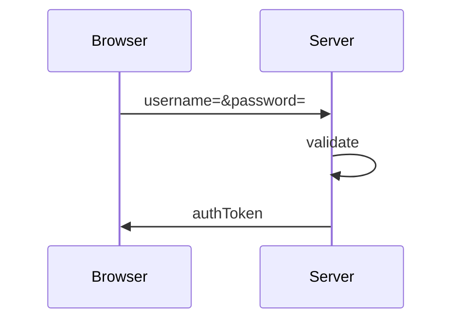
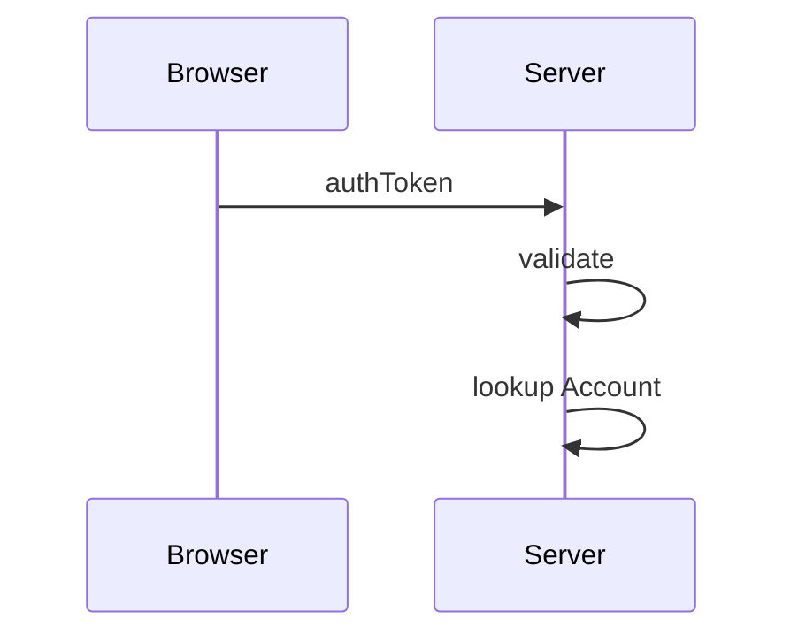
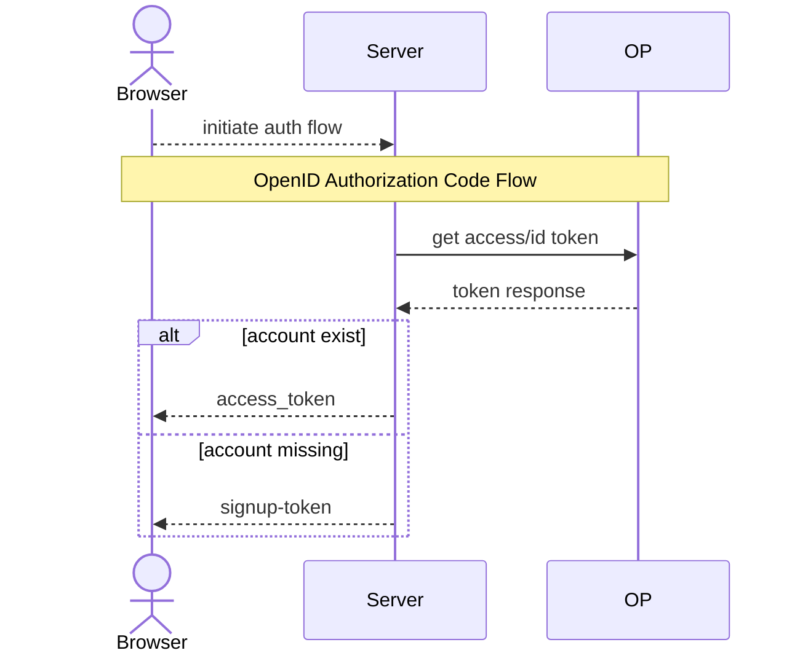

# webapp stub

This is a template repository for making starting a new Scala3 project
a bit quicker. It provides a runnable web application, github actions
etc.

The idea is to clone it, rename and modify as needed.

Please note, this is very opinionated and intended for myself when
starting some small projects. :smile:

## Outline

It consists of these modules:

- `common` contains datastructures and utility code which can be used
  across all other modules, it should be light on dependencies
- `store` contains the code accessing the postgresql database using
  `skunk`
- `backend` uses `store` to create the overall application library
- `server` provides the web application, based on
  [http4s](https://http4s.org), [htmx](https://htmx.org) and
  [tailwindcss](https://tailwindcss.com/). Configuration is done using
  [ciris](https://cir.is/)

The application is a tiny "manage contacts" example application as
described in the [htmx book](https://hypermedia.systems/).

The favicon example is from [favicon.io](https://favicon.io).

### Included "Stub-Features"

It is usually a bit easier to remove things, so this stub implements
some basic functiality that can be useful across all projcts.

- basic mill setup with the above modules, making use of the following:
  - typelevel stack: cats-effect, fs2
  - postgresql and skunk for accessing postgres db
  - http4s, htmx, htmx4s and scalatags for rendering
  - ciris for reading configuration
  - borer for json
  - scribe for logging
- dark/light ui theme with tailwind, controlled via a cookie
- basic site layout with a top bar
- user authenication with password or "auto-user" mode (then some
  pre-defined user is logged in automatically)
- openid connect integration using soidc library
- user registration
- a "version" route for getting version information
- a http4s `AccountMiddleware` for routes requiring an existing accout
- github actions for doing ci and release zips to github release page
- release-drafter setup
- nix dev and ci setup
  - using the
    [devshell-tools](https://github.com/eikek/devshell-tools) flake
  - including container and vms running the external services (like
    postgres or keycloak)
- some unit tests using random postgres databases
  - using the nix dev setup, postgres is started at the beginning and
    killed at the end, it is so much faster than relying on a
    container or vm

### Included Code Examples

As I tend to forget details when not using it regularily, it is nice
to come to some examples to refresh memory. Here are some included
details to serve this purpose:

- Using htmx `hx-on` attribute to change css classes when hovering an element
- Example skunk codecs for (nested) case classes
- a simple idea for i18n with scalatags and htmx

### Authentication Flows

**Local Users**

Login with username and password:

Calling the api with an `AuthToken`

A valid token does not necessarily mean an existing account, as it
might have been removed or locked. However, it is expected that an
account stays active for the validity of a token and only needs to be
looked up again when a now token is issued.

**External Users: OpenID**

When a user is authenticated via OpenID, token validation is passed to
the OP.

When a use is successfully authenticated at the OP, the access token,
id token and refresh token is retrieved from OP. Then the `subject`
and `issuer` claims are used to lookup an account in the database. If
it exists, the access token is returned as an auth token and the
refresh token is updated.

If the account doesn't exist, the user is directed to a signup page
and the access_token, id token and refresh token are sent as an
encrypted cookie. During signup, the information from the token are
used to create the account eventually. If signup is closed an error is
returned immediately.

## Nix

The `flake.nix` provides a convenient development setup. It makes sure
mill and other tools are available. It also provides a development
container (or vm), that makes external services available, like the
postgresql database and keycloak. When running on NixOS, the container
can be used. If not running NixOS, it a vm can be used instead, just
enter a different development shell with `nix develop .#vm`. This is
provided by [devshell-tools](https://github.com/eikek/devshell-tools).

The default development shell can be entered via `nix develop`.

There is a another development shell, `ci`, which is used by the `ci`
github action.

## Usage

Clone this repo and then use the `init.sh` script to rename to the new
project name. It also removes `.git` folder and creates it anew.

## Testing with Postgres

There is a mill `dbTests` command. This command starts a postgres
server, then runs all the tests and finally stops it. The trait
`PostgresTest` connects first to the `postgres` database and creates a
random db used for each test. This is provided as a cats effect
`Resource` that each test can use or not.

## TODO

- [ ] cache of view responses
- [ ] better error page when openid sends error (invalid client creds
      for example)
